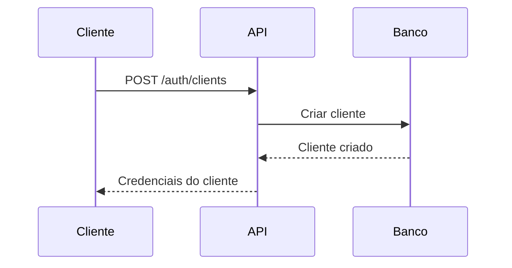
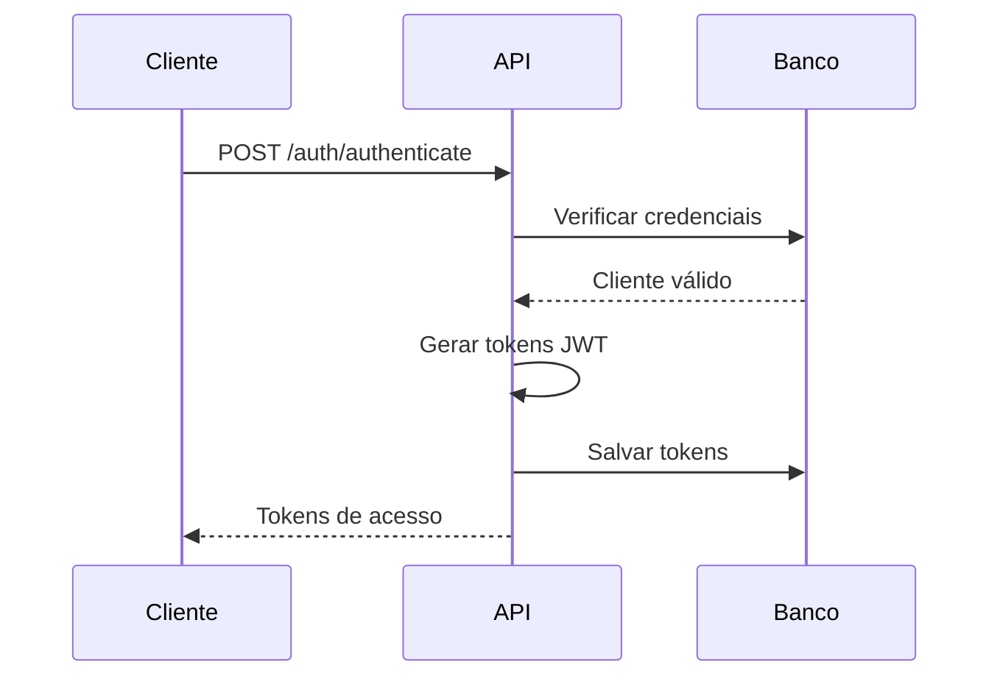
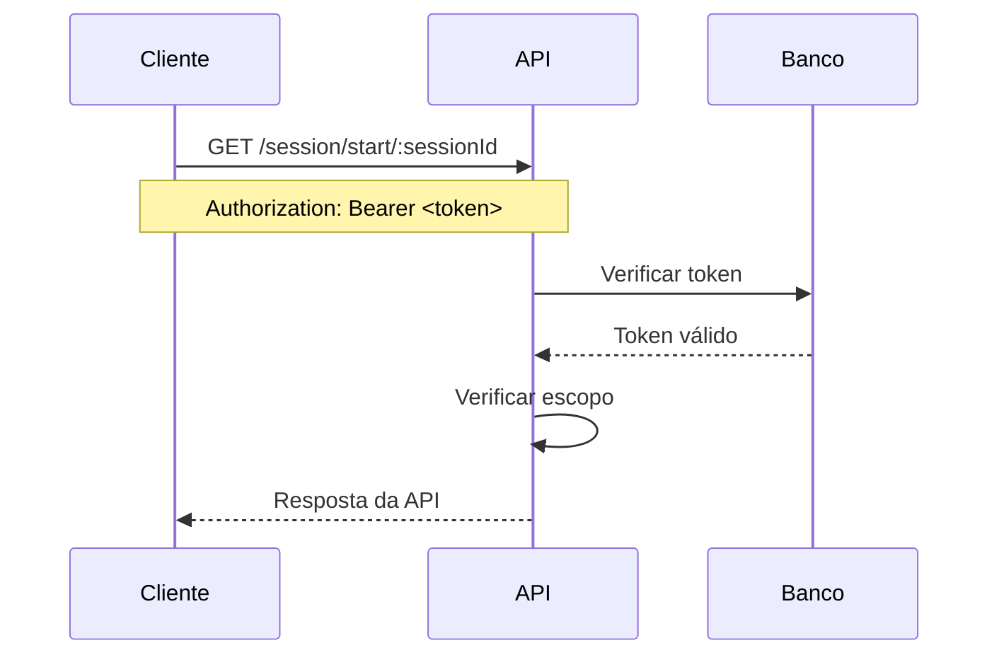
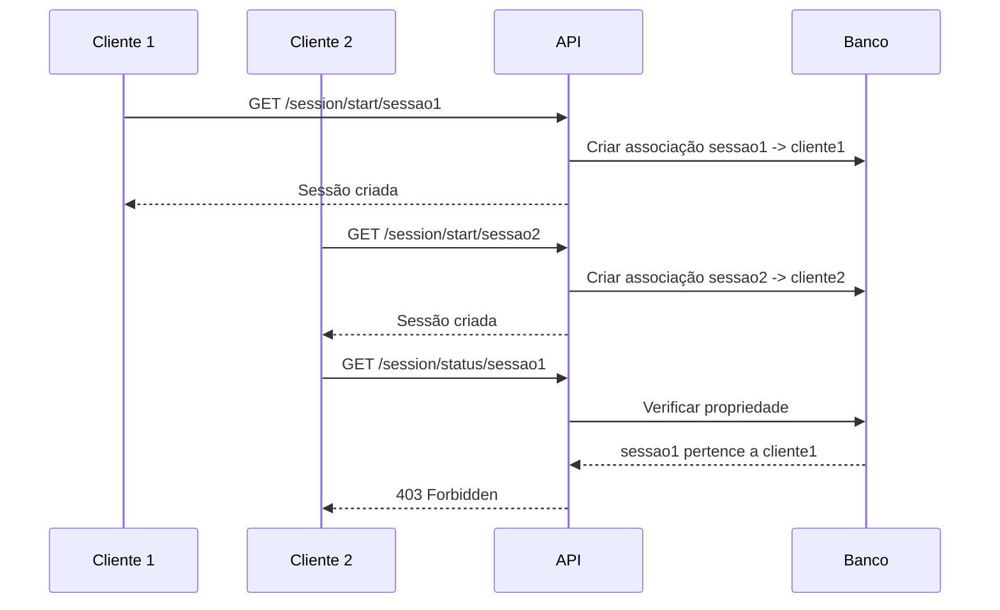

# Sistema de Autenticação e Gerenciamento de Tokens

Este documento descreve o sistema de autenticação implementado para a WhatsApp API, incluindo gerenciamento de clientes, tokens JWT e controle de acesso.

## 📋 Índice

1. [Visão Geral](#visão-geral)
2. [Arquitetura](#arquitetura)
3. [Configuração](#configuração)
4. [Endpoints da API](#endpoints-da-api)
5. [Fluxo de Autenticação](#fluxo-de-autenticação)
6. [Segurança](#segurança)
7. [Exemplos de Uso](#exemplos-de-uso)

## 🎯 Visão Geral

O sistema de autenticação permite:

- **Gerenciamento de Clientes**: Criação, atualização e remoção de clientes
- **Autenticação JWT**: Tokens de acesso e renovação
- **Controle de Escopo**: Permissões granulares por endpoint
- **Admin Master**: API key para acesso total sem autenticação JWT
- **Segurança**: Criptografia de senhas e validação de tokens
- **Auditoria**: Rastreamento de sessões e tokens

## 🏗️ Arquitetura

### Componentes Principais

1. **AuthService** (`src/auth/authService.js`)
   - Lógica de negócio para autenticação
   - Gerenciamento de tokens JWT
   - Operações de CRUD para clientes

2. **AuthController** (`src/controllers/authController.js`)
   - Controladores REST para endpoints de autenticação
   - Validação de entrada
   - Respostas padronizadas

3. **AuthMiddleware** (`src/middleware/authMiddleware.js`)
   - Verificação de tokens
   - Controle de acesso por escopo
   - Validação de propriedade de sessões

4. **Database** (`src/database.js`)
   - Conexão com PostgreSQL
   - Pool de conexões
   - Queries otimizadas

### Banco de Dados

#### Tabela `clients`
```sql
CREATE TABLE clients (
    id SERIAL PRIMARY KEY,
    client_id VARCHAR(255) UNIQUE NOT NULL,
    client_name VARCHAR(255) NOT NULL,
    client_secret VARCHAR(255) NOT NULL,
    description TEXT,
    is_active BOOLEAN DEFAULT true,
    created_at TIMESTAMP DEFAULT CURRENT_TIMESTAMP,
    updated_at TIMESTAMP DEFAULT CURRENT_TIMESTAMP
);
```

#### Tabela `tokens`
```sql
CREATE TABLE tokens (
    id SERIAL PRIMARY KEY,
    client_id VARCHAR(255) NOT NULL REFERENCES clients(client_id),
    access_token VARCHAR(500) UNIQUE NOT NULL,
    refresh_token VARCHAR(500) UNIQUE,
    token_type VARCHAR(50) DEFAULT 'Bearer',
    expires_at TIMESTAMP NOT NULL,
    scope TEXT,
    is_revoked BOOLEAN DEFAULT false,
    created_at TIMESTAMP DEFAULT CURRENT_TIMESTAMP,
    updated_at TIMESTAMP DEFAULT CURRENT_TIMESTAMP
);
```

#### Tabela `whatsapp_sessions`
```sql
CREATE TABLE whatsapp_sessions (
    id SERIAL PRIMARY KEY,
    session_id VARCHAR(255) UNIQUE NOT NULL,
    client_id VARCHAR(255) NOT NULL REFERENCES clients(client_id),
    status VARCHAR(50) DEFAULT 'disconnected',
    created_at TIMESTAMP DEFAULT CURRENT_TIMESTAMP,
    updated_at TIMESTAMP DEFAULT CURRENT_TIMESTAMP
);
```

## ⚙️ Configuração

### 1. Variáveis de Ambiente

Adicione ao seu arquivo `.env`:

```env
# PostgreSQL
POSTGRES_HOST=localhost
POSTGRES_PORT=5432
POSTGRES_DB=whatsapp_auth
POSTGRES_USER=whatsapp_user
POSTGRES_PASSWORD=your_secure_password

# JWT
JWT_SECRET=your_very_secure_jwt_secret
JWT_EXPIRES_IN=24h
JWT_REFRESH_EXPIRES_IN=7d

# Autenticação
ENABLE_AUTH=true

# Admin Master (API key para acesso total)
API_KEY=your_admin_master_api_key_here
```

### 2. Inicialização do Banco

```bash
# Iniciar PostgreSQL
npm run postgres:start

# Inicializar banco de dados
npm run db:init
```

## 🔌 Endpoints da API

### Autenticação (Públicos)

#### POST `/auth/clients`
Cria um novo cliente.

**Request:**
```json
{
  "client_name": "Meu App WhatsApp",
  "description": "Aplicação para integração com WhatsApp"
}
```

**Response:**
```json
{
  "success": true,
  "message": "Cliente criado com sucesso",
  "data": {
    "id": 1,
    "client_id": "550e8400-e29b-41d4-a716-446655440000",
    "client_name": "Meu App WhatsApp",
    "client_secret": "550e8400-e29b-41d4-a716-446655440001",
    "description": "Aplicação para integração com WhatsApp",
    "is_active": true,
    "created_at": "2024-01-01T00:00:00.000Z"
  }
}
```

#### POST `/auth/authenticate`
Autentica um cliente e retorna tokens.

**Request:**
```json
{
  "client_id": "550e8400-e29b-41d4-a716-446655440000",
  "client_secret": "550e8400-e29b-41d4-a716-446655440001",
  "scope": "read write"
}
```

**Response:**
```json
{
  "success": true,
  "message": "Autenticação bem-sucedida",
  "data": {
    "access_token": "eyJhbGciOiJIUzI1NiIsInR5cCI6IkpXVCJ9...",
    "refresh_token": "eyJhbGciOiJIUzI1NiIsInR5cCI6IkpXVCJ9...",
    "token_type": "Bearer",
    "expires_in": 86400,
    "scope": "read write"
  }
}
```

#### POST `/auth/refresh`
Renova um token de acesso.

**Request:**
```json
{
  "refresh_token": "eyJhbGciOiJIUzI1NiIsInR5cCI6IkpXVCJ9..."
}
```

#### POST `/auth/revoke`
Revoga um token de acesso.

**Request:**
```json
{
  "access_token": "eyJhbGciOiJIUzI1NiIsInR5cCI6IkpXVCJ9..."
}
```

#### POST `/auth/verify`
Verifica se um token é válido.

**Request:**
```json
{
  "access_token": "eyJhbGciOiJIUzI1NiIsInR5cCI6IkpXVCJ9..."
}
```

### Admin Master (API Key)

O sistema suporta um **Admin Master** que pode acessar qualquer funcionalidade usando apenas uma API key, sem necessidade de autenticação JWT.

#### Como Usar Admin Master

```bash
# Acessar qualquer endpoint com API key master
curl -X GET http://localhost:3000/session/start/minha-sessao \
  -H "x-api-key: YOUR_ADMIN_MASTER_API_KEY"

# Listar todos os clientes
curl -X GET http://localhost:3000/auth/clients \
  -H "x-api-key: YOUR_ADMIN_MASTER_API_KEY"

# Acessar sessão de qualquer cliente
curl -X GET http://localhost:3000/session/status/sessao-de-outro-cliente \
  -H "x-api-key: YOUR_ADMIN_MASTER_API_KEY"
```

#### Privilégios do Admin Master

- ✅ **Acesso total**: Pode acessar qualquer endpoint
- ✅ **Todas as sessões**: Pode acessar sessões de qualquer cliente
- ✅ **Operações administrativas**: Pode gerenciar clientes e tokens
- ✅ **Sem escopo**: Não precisa de escopos específicos
- ✅ **Sem token JWT**: Usa apenas API key no header `x-api-key`

### Gerenciamento de Clientes (Protegidos)

#### GET `/auth/clients`
Lista todos os clientes (requer escopo `admin`).

#### GET `/auth/clients/:clientId`
Obtém informações de um cliente específico (requer escopo `admin`).

#### PUT `/auth/clients/:clientId`
Atualiza um cliente (requer escopo `admin`).

#### DELETE `/auth/clients/:clientId`
Remove um cliente (requer escopo `admin`).

#### GET `/auth/clients/:clientId/tokens`
Lista tokens de um cliente (requer escopo `admin`).

#### GET `/auth/clients/:clientId/sessions`
Lista sessões WhatsApp de um cliente (requer escopo `admin`).

## 🔄 Fluxo de Autenticação

### 1. Criação de Cliente


### 2. Autenticação


### 3. Uso da API


### 4. Associação de Sessões


## 🔒 Segurança

### Medidas Implementadas

1. **Criptografia de Senhas**
   - Uso do bcrypt com salt rounds = 12
   - Senhas nunca são armazenadas em texto plano

2. **Tokens JWT**
   - Assinatura com chave secreta
   - Expiração configurável
   - Refresh tokens para renovação segura

3. **Controle de Acesso**
   - Escopos granulares (read, write, admin)
   - Verificação de propriedade de sessões
   - Middleware de autenticação em todas as rotas protegidas

4. **Associação de Sessões**
   - Cada sessão WhatsApp é associada ao cliente que a criou
   - Clientes só podem acessar suas próprias sessões
   - Prevenção de acesso não autorizado a sessões de outros clientes
   - Status de sessão rastreado no banco de dados

5. **Validação de Entrada**
   - Sanitização de dados
   - Validação de tipos e formatos
   - Proteção contra SQL injection

5. **Auditoria**
   - Logs de todas as operações
   - Rastreamento de tokens
   - Histórico de sessões

### Escopos Disponíveis

- `read`: Acesso de leitura (GET endpoints)
- `write`: Acesso de escrita (POST, PUT, DELETE endpoints)
- `admin`: Acesso administrativo (gerenciamento de clientes)

## 💡 Exemplos de Uso

### 1. Criar Cliente e Autenticar

```bash
# 1. Criar cliente
curl -X POST http://localhost:3000/auth/clients \
  -H "Content-Type: application/json" \
  -d '{
    "client_name": "Meu App",
    "description": "Aplicação de teste"
  }'

# 2. Autenticar
curl -X POST http://localhost:3000/auth/authenticate \
  -H "Content-Type: application/json" \
  -d '{
    "client_id": "CLIENT_ID_RETORNADO",
    "client_secret": "CLIENT_SECRET_RETORNADO",
    "scope": "read write"
  }'
```

### 2. Usar API com Token

```bash
# Iniciar sessão WhatsApp
curl -X GET http://localhost:3000/session/start/minha-sessao \
  -H "Authorization: Bearer SEU_ACCESS_TOKEN"

# Enviar mensagem
curl -X POST http://localhost:3000/client/sendMessage/minha-sessao \
  -H "Authorization: Bearer SEU_ACCESS_TOKEN" \
  -H "Content-Type: application/json" \
  -d '{
    "chatId": "5511999999999@c.us",
    "message": "Olá!"
  }'
```

### 3. Renovar Token

```bash
curl -X POST http://localhost:3000/auth/refresh \
  -H "Content-Type: application/json" \
  -d '{
    "refresh_token": "SEU_REFRESH_TOKEN"
  }'
```

### 4. JavaScript/Node.js

```javascript
const axios = require('axios');

// Configurar cliente
const api = axios.create({
  baseURL: 'http://localhost:3000',
  headers: {
    'Authorization': `Bearer ${accessToken}`,
    'Content-Type': 'application/json'
  }
});

// Usar API
async function sendMessage() {
  try {
    const response = await api.post('/client/sendMessage/minha-sessao', {
      chatId: '5511999999999@c.us',
      message: 'Olá!'
    });
    console.log('Mensagem enviada:', response.data);
  } catch (error) {
    console.error('Erro:', error.response.data);
  }
}
```

### 5. Exemplo de Associação de Sessões

```javascript
// Cliente 1 cria uma sessão
const client1 = axios.create({
  baseURL: 'http://localhost:3000',
  headers: { 'Authorization': `Bearer ${token1}` }
});

// Cliente 2 tenta acessar a sessão do Cliente 1
const client2 = axios.create({
  baseURL: 'http://localhost:3000',
  headers: { 'Authorization': `Bearer ${token2}` }
});

// ✅ Cliente 1 pode acessar sua própria sessão
await client1.get('/session/status/minha-sessao');

// ❌ Cliente 2 NÃO pode acessar a sessão do Cliente 1
try {
  await client2.get('/session/status/minha-sessao');
} catch (error) {
  console.log('Acesso negado:', error.response.status); // 403
}

// ✅ Cliente 2 pode criar sua própria sessão
await client2.get('/session/start/minha-sessao-2');
```

### 6. Exemplo de Admin Master

```javascript
// Admin Master com API key
const adminMaster = axios.create({
  baseURL: 'http://localhost:3000',
  headers: { 'x-api-key': 'YOUR_ADMIN_MASTER_API_KEY' }
});

// ✅ Admin Master pode acessar qualquer sessão
await adminMaster.get('/session/status/sessao-de-qualquer-cliente');

// ✅ Admin Master pode listar todos os clientes
const clients = await adminMaster.get('/auth/clients');

// ✅ Admin Master pode usar qualquer operação WhatsApp
await adminMaster.get('/client/getState/sessao-de-qualquer-cliente');

// ✅ Admin Master pode acessar sessões que não existem no banco
await adminMaster.get('/session/status/sessao-inexistente');
```

## 🚀 Comandos Úteis

```bash
# Iniciar serviços
npm run postgres:start
npm run redis:start

# Inicializar banco
npm run db:init

# Ver logs
npm run postgres:logs
npm run redis:logs

# Reset completo do banco
npm run db:reset

# Testes
npm run test:auth
npm run test:session-ownership
npm run test:admin-master

# Parar serviços
npm run postgres:stop
npm run redis:stop
```

## 📝 Notas Importantes

1. **Segurança**: Sempre altere as senhas padrão em produção
2. **Backup**: Configure backup regular do banco PostgreSQL
3. **Monitoramento**: Monitore logs de autenticação e tokens
4. **Rate Limiting**: Configure limites de taxa para endpoints de autenticação
5. **HTTPS**: Use HTTPS em produção para proteger tokens

## 🐛 Troubleshooting

### Erro de Conexão com Banco
```bash
# Verificar se PostgreSQL está rodando
docker ps | grep postgres

# Verificar logs
npm run postgres:logs

# Reiniciar serviço
npm run postgres:stop
npm run postgres:start
```

### Token Inválido
- Verificar se o token não expirou
- Verificar se o token não foi revogado
- Verificar se o cliente está ativo

### Erro de Escopo
- Verificar se o token tem o escopo necessário
- Verificar se o cliente tem permissão para a operação 